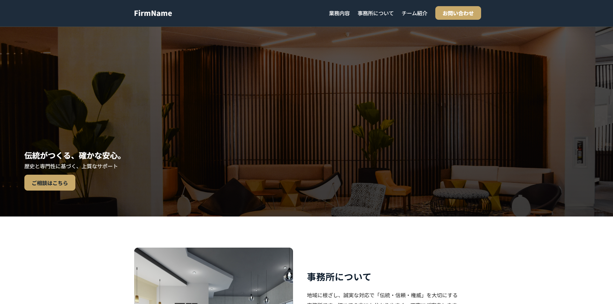

# Template 02 — Corporate Site

シンプルなコーポレート向け HTML/CSS テンプレートです。スマホ・タブレット・PC 各サイズに対応しています。

## デモ
- Live: https://mmmiiiyyyaaazzz.github.io/template2-portfolio/
- Source: このリポジトリ

## 特徴
- レイアウト: CSS Grid / Flex をベースにレスポンシブ対応
- 主なセクション:  
  - Hero（トップビジュアル）  
  - News（お知らせ）  
  - Works（実績）  
  - FAQ（よくある質問）  
  - Access（所在地・地図）  
  - Contact（問い合わせフォーム）
- アクセシビリティ: スキップリンクを導入、フォームは完了メッセージ／エラーメッセージをスクリーンリーダーでも読めるよう調整済み

## ファイル構成（抜粋）
/
├─ index.html  
├─ css/  
│   ├─ snippets.css  
│   ├─ theme.css  
│   └─ responsive.css  
└─ docs/img/  
    └─ template02-2.png

## 使い方
1. ZIP ダウンロード or `git clone`
2. `index.html` をブラウザで開く（ビルド不要）
3. 必要に応じて `css/theme.css` のカラーバリエーションを調整

## スクリーンショット

## 今後の予定
- 必要に応じて CTA コンポーネントやフォーム周辺の微調整を追加
