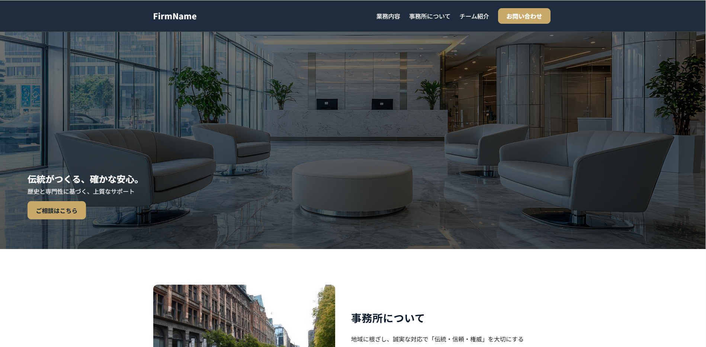

# Template 02 — Corporate Site
FAQ / News / お問い合わせフォームを備えたコーポレート想定のテンプレート。レスポンシブ対応。

## デモ
- Live: https://mmmiiiyyyaaazzz.github.io/template2-portfolio/
- Source: このリポジトリ

## 特徴
- レイアウト: CSS Grid / Flex
- セクション: Hero / About / Services / FAQ / News / Works / Flow / Access / Contact
- アクセシビリティ: スキップリンク、フォーム完了メッセージ整備予定

## ファイル構成（抜粋）
/
├─ index.html
├─ css/
│  └─ （使用中のCSSファイルを配置：例 `theme.css`, `responsive.css` など）
├─ docs/
│  └─ img/
│     └─ template02.png
└─ （必要な画像・スクリプトなど）

## 使い方
1. ZIPダウンロード or `git clone`
2. `index.html` をブラウザで開く（ビルド不要）

## スクリーンショット

## 今後の予定
- フォーム完了メッセージに `aria-live` 付与
- 必須エラーの補助文と `aria-describedby` の整理
